# Library DDD Architecture Documentation

## Table of Contents
1. [Overview](#overview)
2. [Overall System Architecture](#overall-system-architecture)
3. [Bounded Contexts](#bounded-contexts)
4. [Layer Architecture](#layer-architecture)
5. [Domain Layer](#domain-layer)
6. [Application Layer](#application-layer)
7. [Infrastructure Layer](#infrastructure-layer)
8. [Interface Layer](#interface-layer)
9. [Cross-Context Communication](#cross-context-communication)
10. [Database Schema](#database-schema)
11. [Component Inventory](#component-inventory)

---

## Overview

This document describes the Domain-Driven Design (DDD) architecture of the **Library DDD** application, a practical Python web application implementing a library management system with two independent bounded contexts: **Catalog** and **Borrowing**.

### Key DDD Principles Applied

- **Bounded Contexts**: Clear separation of concerns between Catalog and Borrowing
- **Single Composition Root**: All dependency wiring happens in one place
- **Layered Architecture**: Each context follows Domain → Application → Infrastructure → Interface
- **Clean Dependencies**: Each layer only depends on the layer below it
- **Cross-Context Communication**: Contexts communicate through well-defined interfaces, not direct dependencies

---

## Overall System Architecture

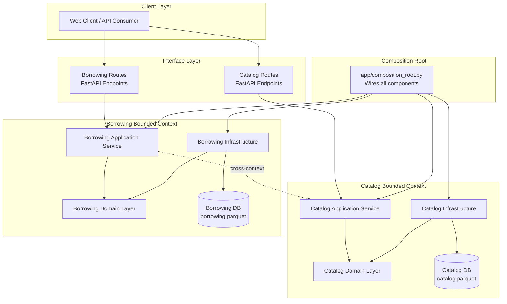

### Architecture Flow

1. **Client** sends HTTP requests to FastAPI routes
2. **Routes** (Interface Layer) receive requests and delegate to Application Services
3. **Application Services** orchestrate domain logic and coordinate with Infrastructure
4. **Infrastructure** handles persistence via DuckDB/Parquet
5. **Composition Root** wires everything together at startup

---

## Bounded Contexts

The application defines two independent bounded contexts:

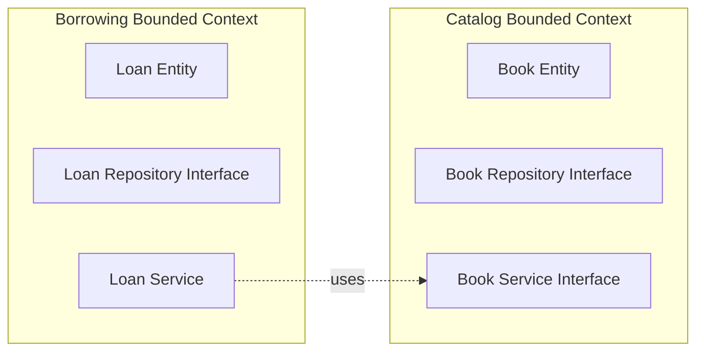

| Aspect | Catalog | Borrowing |
|--------|---------|-----------|
| **Responsibility** | Manage book inventory | Track book loans/returns |
| **Data** | Books, availability | Loans, borrowers |
| **Key Entity** | `Book` | `Loan` |
| **Database** | `catalog.parquet` | `borrowing.parquet` |

---

## Layer Architecture

Each bounded context follows a four-layer architecture:

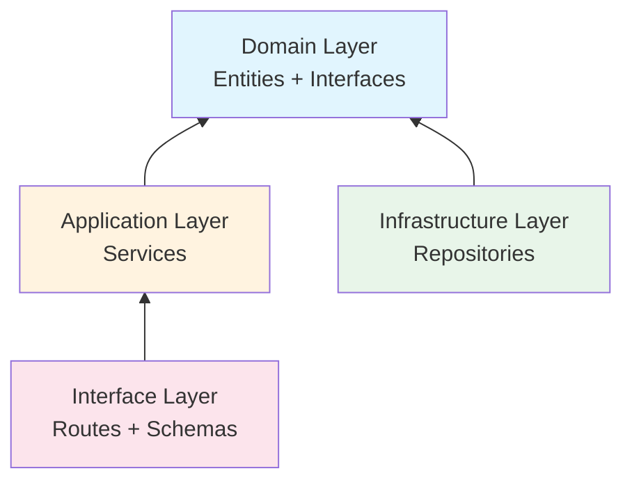

### Layer Dependencies (Catalog Example)

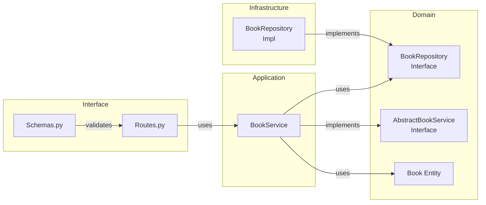

---

## Domain Layer

### Catalog Domain

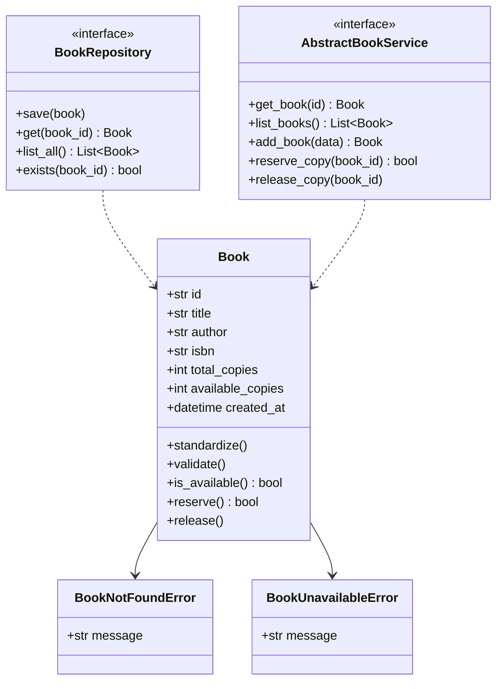

### Borrowing Domain

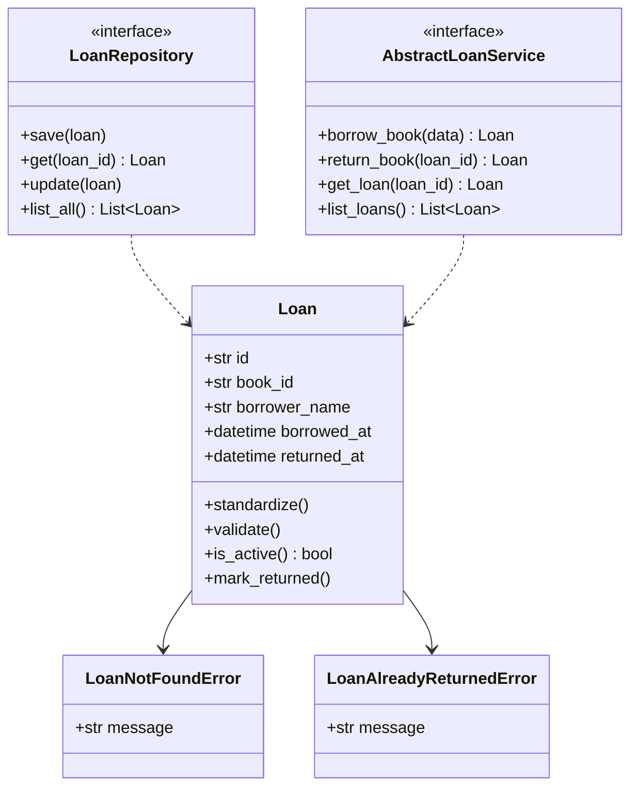

---

## Application Layer

### BookService (Catalog)

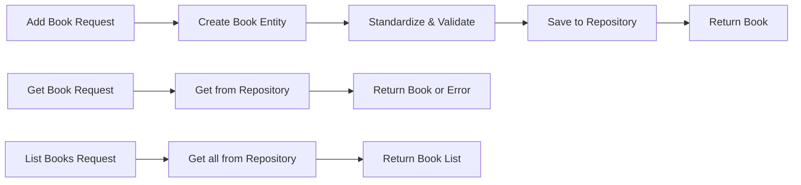

### LoanService (Borrowing with Cross-Context)

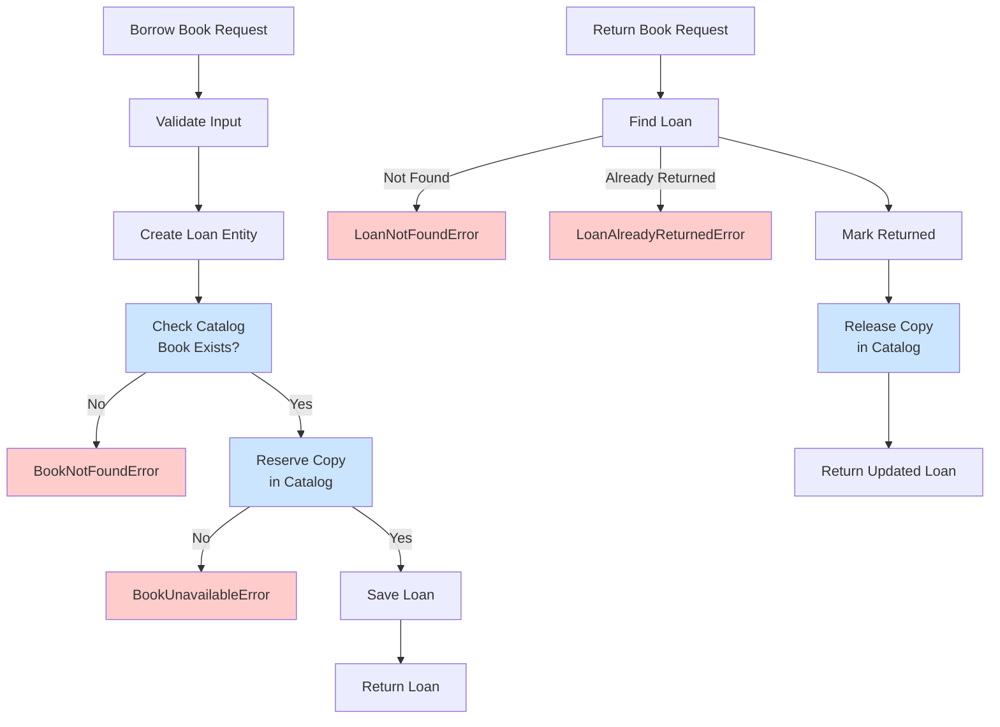

---

## Infrastructure Layer

### Repository Implementations

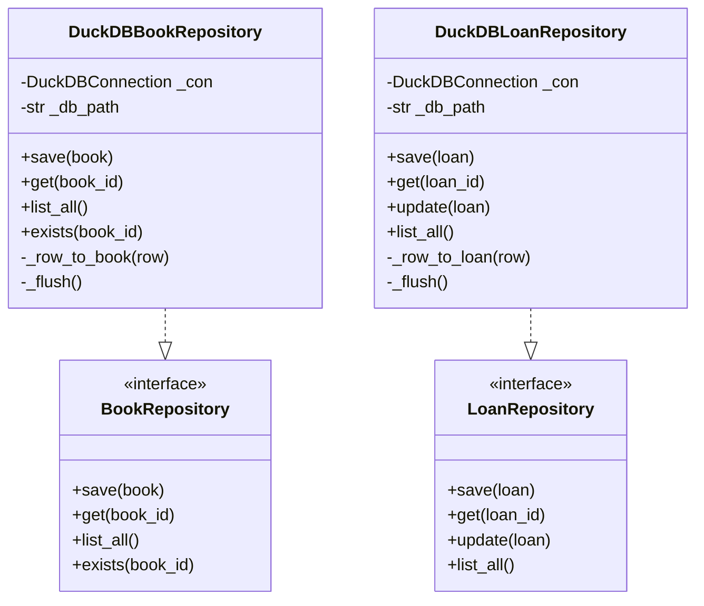

---

## Interface Layer

### API Endpoints

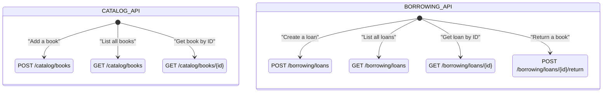

### Request/Response Schemas

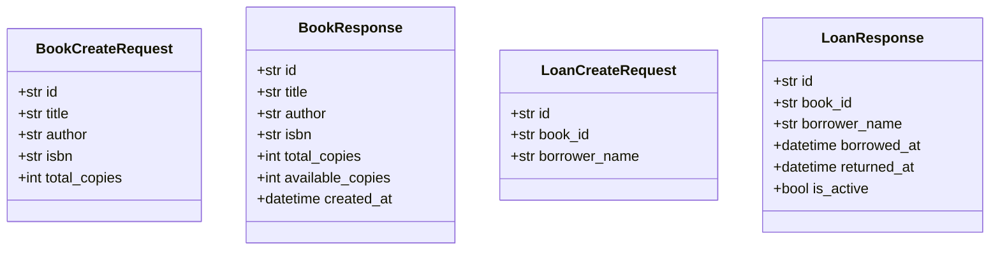

---

## Cross-Context Communication

### How Catalog and Borrowing Talk to Each Other

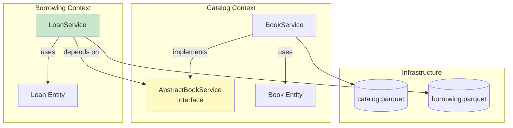

### Communication Flow

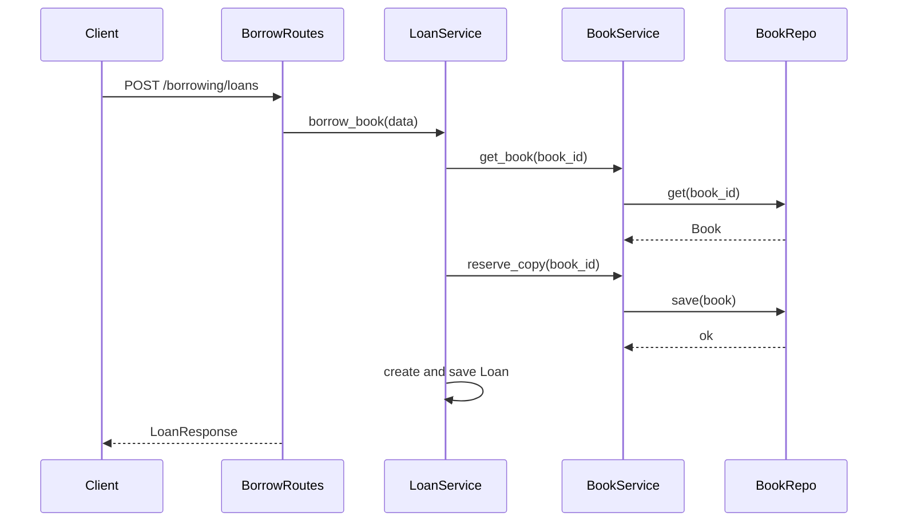

### Key Design Decision: Interface Injection

The **Borrowing** context does NOT import anything from **Catalog** domain. Instead:

```python
# In composition_root.py
book_service = BookService(book_repo)
loan_service = LoanService(loan_repo, book_service)  # Inject via interface
```

This means:
- If Catalog context is removed, Borrowing still works (just fails at runtime)
- New catalog implementations can be swapped without changing Borrowing code
- Both contexts can be tested independently

---

## Database Schema

### Catalog Database (catalog.parquet)

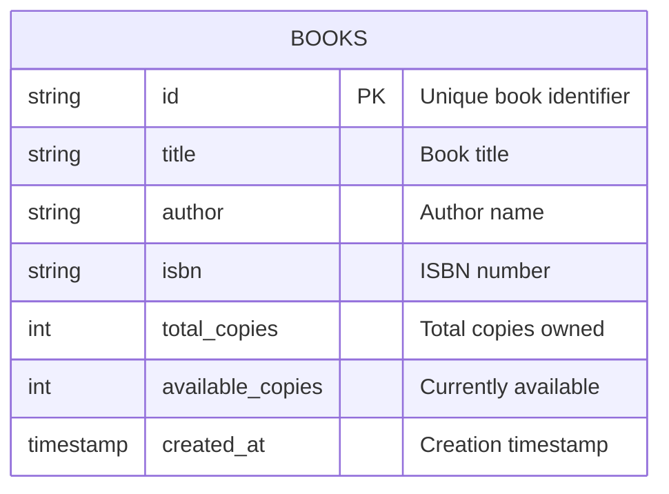

### Borrowing Database (borrowing.parquet)

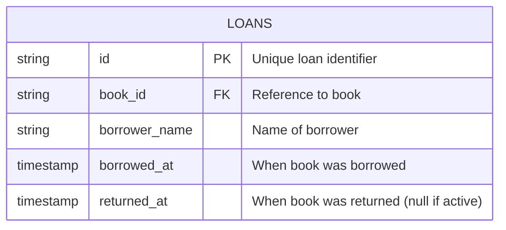

### DuckDB Implementation Details

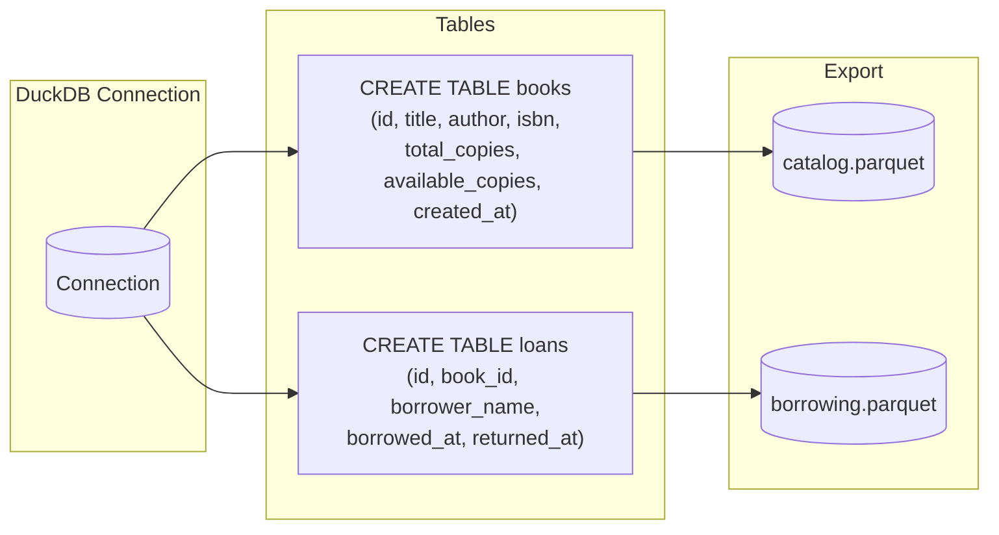

---

## Component Inventory

### Catalog Context Files

| File | Type | Purpose |
|------|------|---------|
| `modules/catalog/domain/book.py` | Entity | Book with business logic |
| `modules/catalog/domain/book_repository.py` | Interface | Repository contract |
| `modules/catalog/domain/book_service.py` | Interface | Service contract for cross-context |
| `modules/catalog/application/services/book_service_impl.py` | Service | Business logic implementation |
| `modules/catalog/infrastructure/repositories/duckdb_book_repository.py` | Repository | DuckDB implementation |
| `modules/catalog/interface/routes.py` | Routes | HTTP endpoints |
| `modules/catalog/interface/schemas.py` | Schema | Pydantic DTOs |

### Borrowing Context Files

| File | Type | Purpose |
|------|------|---------|
| `modules/borrowing/domain/loan.py` | Entity | Loan with business logic |
| `modules/borrowing/domain/loan_repository.py` | Interface | Repository contract |
| `modules/borrowing/application/services/loan_service.py` | Service | Cross-context orchestrator |
| `modules/borrowing/infra/repositories/duckdb_loan_repository.py` | Repository | DuckDB implementation |
| `modules/borrowing/interface/routes.py` | Routes | HTTP endpoints |
| `modules/borrowing/interface/schemas.py` | Schema | Pydantic DTOs |

### Shared/Common Files

| File | Purpose |
|------|---------|
| `app/composition_root.py` | **Single** place that wires all components |
| `main.py` | Application entry point |
| `seed_demo_data.py` | Populate demo data |
| `test_smoke.py` | End-to-end tests |

---

## Directory Structure

```
library_ddd/
├── app/
│   └── composition_root.py    # All dependency wiring here
├── modules/
│   ├── catalog/
│   │   ├── domain/             # Pure business logic
│   │   │   ├── book.py
│   │   │   ├── book_repository.py
│   │   │   └── book_service.py
│   │   ├── application/        # Use cases
│   │   │   └── services/
│   │   │       └── book_service_impl.py
│   │   ├── infrastructure/     # External concerns
│   │   │   └── repositories/
│   │   │       └── duckdb_book_repository.py
│   │   └── interface/          # HTTP layer
│   │       ├── routes.py
│   │       └── schemas.py
│   └── borrowing/
│       ├── domain/
│       │   ├── loan.py
│       │   └── loan_repository.py
│       ├── application/
│       │   └── services/
│       │       └── loan_service.py
│       ├── infrastructure/
│       │   └── repositories/
│       │       └── duckdb_loan_repository.py
│       └── interface/
│           ├── routes.py
│           └── schemas.py
├── data/
│   ├── catalog.parquet         # Catalog DB
│   └── borrowing.parquet       # Borrowing DB
├── main.py                     # Entry point
├── seed_demo_data.py           # Demo data seeder
└── test_smoke.py               # Smoke tests
```

---

## Running the Application

```bash
# 1. Seed demo data
python seed_demo_data.py

# 2. Start the API
python main.py

# 3. Access API documentation
# Open http://localhost:8000/docs

# 4. Run smoke tests
python test_smoke.py
```

---

## Summary

This DDD architecture provides:

1. **Separation of Concerns**: Each bounded context is independent
2. **Testability**: Each layer can be tested in isolation
3. **Maintainability**: Clear boundaries make the codebase easy to navigate
4. **Flexibility**: Cross-context communication via interfaces allows easy swapping of implementations
5. **Persistence**: DuckDB with Parquet files provides a lightweight, file-based database solution